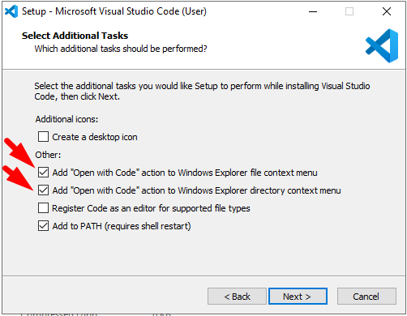

# Criando uma WebAPI com NodeJS

## Parte 1 - Preparando o ambiente

Nesta etapa será feita a preparação do ambiente de desenvolvimento.

Serão instalados:
   - NodeJS v12.x.x
   - Visual Studio Code (VSCode)


---
### Instalando o NodeJS

Baixe e instale a versão v12 mais atual estável do NodeJS no site [https://nodejs.org/pt-br/download/](https://nodejs.org/pt-br/download/).

Teste sua instalação, abrindo uma janela de linha de comando no Windows e digitando os comandos:
```console
node --version
npm --version
```

Exemplo de resposta:
```console
C:\>node --version
v12.14.1

C:\>npm --version
6.13.4
```


---
### Instalando o Visual Studio Code (VSCode)

Baixe a versão estável (Stable Build) do site [https://code.visualstudio.com/](https://code.visualstudio.com/) e execute a instalação.

> **Dica** - Marque as opções **"Open with Code"** durante a instalação.
> 


---
### Referências
 
 - [NodeJS](https://nodejs.org/en/)
 - [NodeJS - w3schools.com](https://www.w3schools.com/nodejs/default.asp)
  - [Visual Studio Code](https://code.visualstudio.com)
