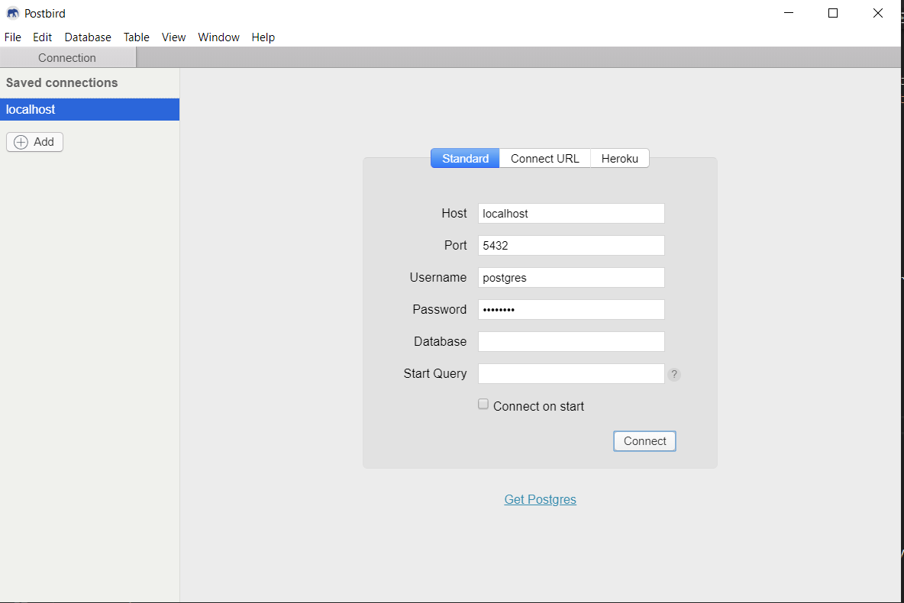
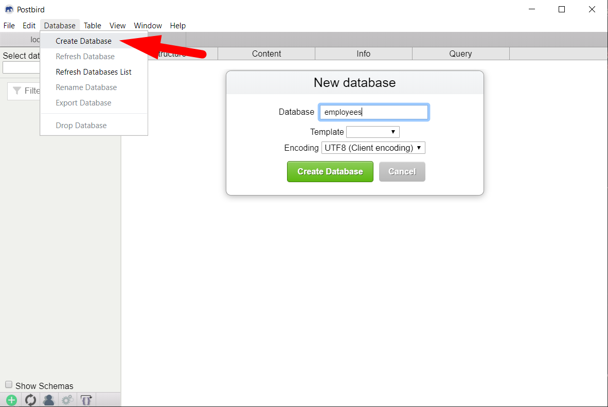

# Criando uma WebAPI com NodeJS

## Parte 3 - Persistindo os dados no banco de dados PostgreSQL

Nesta etapa vamos persistir os dados dos empregados no banco de dados PostgreSQL, utilizando comandos SQL Ansi.


---
### Instalação do PostgreSQL

Você pode instalar o PostgreSQL no seu Windows ou instalar o **docker** e rodar o PostgreSQL pelo docker.

**Instalação nativa no Windows**

- Baixe e instale o PostgreSQL - [https://www.postgresql.org/](https://www.postgresql.org/)

**Rodar pelo docker**

- Instale o docker para o Windows
  - Acesse o link [de download do Docker](https://hub.docker.com/editions/community/docker-ce-desktop-windows/) e clique no botão **Get Docker**
  - Utilize a opção Linux, quando solicitado
- Após instalado, execute os comando para rodar um container do PostgreSQL:
  ```console
  docker run --name postgres -e POSTGRES_PASSWORD=postgres -d postgres
  ```
  > Para confirmar que o serviço está rodando, execute: ```docker ps``` e verifique se o container postgres foi listado.
  > Após rodar o container a primeira vez, para inicar o serviço novamente basta executar o comando: ```docker start postgres```


---
### Instalação de um Client para o PostgreSQL

Um software cliente para fazer consultas SQL no PostgreSQL será necessário.

A recomendação neste tutorial é utilizar o **Postbird**.

- entre no link [https://github.com/Paxa/postbird/releases](https://github.com/Paxa/postbird/releases) e baixe a versão para Windows mais atual


---
### Preparando o banco de dados

- Conectar no banco de dados:
  
- Criando uma nova Database: **employees**
  
- Selecione o banco criado **employees** e clique na aba **Query** para executar o script de criação da tabela **employees**
  ```sql
  create table employees (
    id SERIAL primary key not null,
    name varchar(255) not null,
    salary numeric(10,2),
    age int,
    profile_image varchar(255)
  )
  ```


---
### Adicionando a biblioteca do PostgreSQL na aplicação

- Na linha de comando no diretório raiz da aplicação e execute:
  ```console
  npm install pg --save
  ```


---
### Criando o pool de conexão com o banco de dados

- Organizando diretórios da aplicação:
  ```console
  mkdir db
  ```
- Crie o arquivo index.js dentro do diretório db:
  ```js
  const { Pool } = require('pg');
  require('dotenv').config();

  const pool = new Pool();

  module.exports = {
      query: (text, params) => pool.query(text, params),
  }
  ```


---
### Criando o arquivo .env com as configurações de acesso ao banco PostgreSQL

- Crie o arquivo .env na raiz do projeto, contendo:
  ```none
  PGHOST='localhost'
  PGUSER='postgres'
  PGDATABASE='employees'
  PGPASSWORD='postgres'
  PGPORT=5432
  ```


---
### Criando a classe EmployeesRepositoryPgSql

- Organizando diretórios da aplicação:
  ```console
  mkdir persistence
  ```
- Crie a classe EmployeesRepositoryPgSql dentro do diretório persistence:
  ```js
  const db = require('../db');
  
  class EmployeesRepositoryPgSql {
      constructor(db) {
          this.db = db;
      }

      findAll = async () => {
          var result = await db.query('select id, name, salary, age, profile_image as profile_image from employees');
          return result.rows;
      }

      findById = async (id) => {
          var result = await db.query('select id, name, salary, age, profile_image as profile_image from employees where id=$1 ', [id]);
          if (result.rows.length > 0)
              return result.rows[0];
          else
              return null;
      }

      add = async (employee) => {
          var result = await db.query('insert into employees (name, salary, age, profile_image) values ($1, $2, $3, $4) RETURNING id',
              [employee.name, employee.salary, employee.age, employee.profile_image]);
          if (result.rows.length > 0) {
              employee.id = result.rows[0].id;
              console.log(employee);
              return employee;
          }
          else {
              return null;
          }
      }

      update = async (employee) => {
          var result = await db.query('update employees set name=$1, salary=$2, age=$3, profile_image=$4 where id=$5',
              [employee.name, employee.salary, employee.age, employee.profile_image, employee.id]);
          console.log(result);
          if (result.rowCount > 0)
              return employee;
          else
              return null;
      }

      deleteById = async (id) => {
          const employee = this.findById(id);
          if (employee == null)
              return null;
          const result = await db.query('delete from employees where id=$1', [id]);
          return employee;
      }
  }
  module.exports = new EmployeesRepositoryPgSql(db);
  ```


#### Ajustando a classe EmployeesService para utilizar a classe EmployeesRepositoryPgSql

- Altere o início do arquivo services\EmployeesService.js:
  ```js
  //const repository = require('../persistence/EmployeesRepositoryMemory');
  const repository = require('../persistence/EmployeesRepositoryPgSql');
  
  ... continuação...
  ```

#### Execute a aplicação

Nesta etapa vamos compilar e executar a aplicação:

- Para executar a aplicação, basta executar na linha de comando:
  ```csharp
  dotnet start
  ```

#### Testando a aplicação com o Postman

Para testar os endpoints da aplicação, vamos utilizar o Postman.

Em paralelo, execute os comandos SQL no Postird para verificar que os dados foram persistidos no banco.


---
### Referências
 - [Docker](https://hub.docker.com/editions/community/docker-ce-desktop-windows/)
 - [Docker](https://docs.docker.com/docker-for-windows/install-windows-home/)
 - [PostgreSQL no Docker](https://hub.docker.com/_/postgres)
 - [node-postgres](https://node-postgres.com/)
